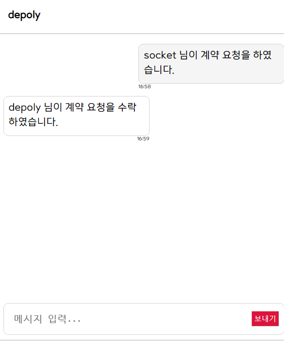

# 시연 시나리오(화면별 상세 설명)

## 1. 메인 화면

### A. 위치 기반 추천 매물

사용자가 위치 등록을 허가할 시 위치기반으로 매물의 메인 이미지와 가격 및 상세 설명을 출력한다.

 

### B. 검색

위치를 입력할 시 매물 페이지로 이동한다.

 

 

## 2. 매물 등록

### A. 매물 정보

매물의 유형에 관련된 정보를 선택할 수 있다.

- 매물정보 : 이어살기, 쉐어하우스
- 종류 : 원룸, 투룸, 쓰리룸

 

### B. 거래 정보

매물을 거래하기 위한 금액과 관련된 정보를 입력할 수 있으며 매물에 부가되는 관리비와 임대기간을 설정할 수 있다.

- 계약 정보 : 전세, 월세
- 가격정보
- 관리비 : 어떤 목적으로 사용되는 관리비인지 명시
- 임대기간

 

### C. 옵션 정보 및 위치 정보

- 옵션 항목
- 위치 정보 : 주소 API 를 활용한 주소 검색과 상세주소 입력

 

### D. 사진 등록

 

### E. 상세 설명

Continew에서 제공하는 양식외에 사용자가 추가로 설명하고 싶은 부분을 설명하는 공간

 

### F. 약관

 

 

## 3. 지도

지도의 축적에 따라 보여주는 매물의 개수가 달라진다.

### A. 매물 목록

제공하는 여러 필터링 기능을 사용해 사용자에게 맞는 매물을 보여준다.

- 이어살기, 쉐어하우스

- 거래 유형 : 월세, 전세

- 가격 : 보증금, 월세, 관리비

- 임대기간 : 0~12개월

  

- 옵션

  

   

### B. 매물 상세 페이지

매물의 이미지를 확인 할 수 있고 형태와 가격 정보 및 여러 옵션등을 확인 할 수 있다.

- 인증 : 휴대폰 인증을 한 회원은 인증마크가 달림

- 북마크 기능으로 자신만의 목록을 확인
- 채팅 하기 버튼을 클릭하여 판매자게에 1:1 채팅을 신청

 

 

## 4. 채팅

구매자와 판매자간 1:1 실시간 채팅 기능

### A. 채팅 방

채팅방에 입장을 하면 채팅하는 상대가 보유한 매물 목록을 함께 간략하게 표시

### B. 계약 요청

계약 요청 버튼을 클릭하면 계약 메시지와 함께 판매자에게 계약을 생성할 수 있는 탭이 생긴다.

**구매자**

**판매자**

**계약수락**

 

 

## 5. 계약

3단계에 걸쳐 계약을 진행한다.

### A. 1단계

**1차 계약서 작성**

 

### B. 2단계

**구매자**

구매자가 계약서를 확인하고 각종 정보를 입력하고 먼저 서명한다.

### C. 3단계

**판매자**

구매자가 계약을 서명 후 판매자가 각종 정보를 입력하고 계약서에 서명한다.

### D. 계약 완료

